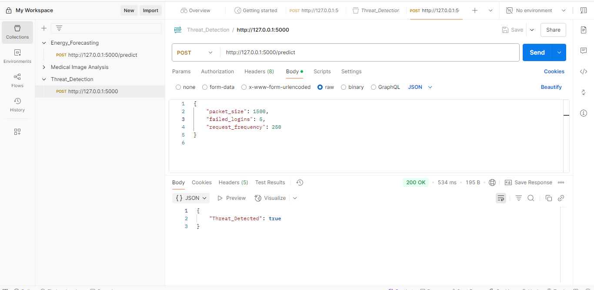

# 🔐AI-Powered-Cybersecurity-Threat-Detection
The AI-Powered Cybersecurity Threat Detection system is designed to identify and respond to cyber threats using machine learning. It analyzes key indicators such as failed login attempts, packet sizes, and request frequency to detect malicious activity in real-time. 

## 🎯 Project Objective -
- The primary objective of this project is to build an intelligent AI system that can:

- Detect various forms of cyberattacks including phishing, malware, and unauthorized access

- Analyze real-time network data to identify unusual behavior patterns

- Utilize machine learning models (e.g., Random Forest) to classify threats accurately

## ❗ Why This Project Matters -
- Traditional systems fail to detect new and evolving threats

- AI enables dynamic pattern recognition and faster detection

- Detects threats in real-time using network behavior

- Reduces reliance on static, rule-based methods

- Scalable and adaptable for modern cybersecurity needs

## 🔧 Tech Stack -
- Python: Core language used for data processing, model training, and API development.

- Scikit-learn: Model training and evaluation

- Pandas & NumPy: For efficient data preprocessing and numerical computations.

- Flask: Lightweight web framework to deploy the trained model as an API.

- Joblib: For saving and loading the trained machine learning model.

- Postman: Tool for testing and validating API endpoints.

- Visual Studio Code (VS Code): Code editor used for writing and managing the project.

## 🧪 How to Use -
### 1. ⚙️ Train the Model
Run the following script to preprocess the data and train the model:
```
python model_training.py
```
### 2. 🚀 Start the Flask API
Start the Flask API to serve the trained model:
```
python app.py
```
### 3. 📬 Send Input via Postman
Send a POST request with this JSON to predict energy consumption:
```
jason
{
    "packet_size": 1500,
    "failed_logins": 5,
    "request_frequency": 250
}
```
### ✅ Output
The API will respond with a predicted energy value:
```
jason
{
    "Threat_Detected": false
}
```
## 📸 Preview -
### Flask Server Running  
  

### Testing with Postman  
 

## 🎓 Learning Outcomes -
- Gained hands-on experience in cybersecurity threat analysis using real-world datasets

- Learned to preprocess and normalize network data for machine learning

- Built and evaluated ML models (e.g., Random Forest) for threat classification

- Developed a Flask-based API for real-time threat detection

- Understood how AI enhances traditional cybersecurity systems

## 📌 License -
This project is for educational and portfolio purposes only. 

📎 Please do not reuse or distribute without permission.

© Rahul Bhoyar, All Rights Reserved.
